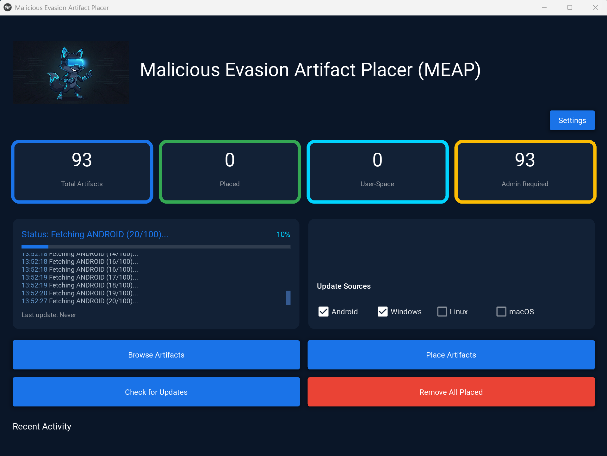
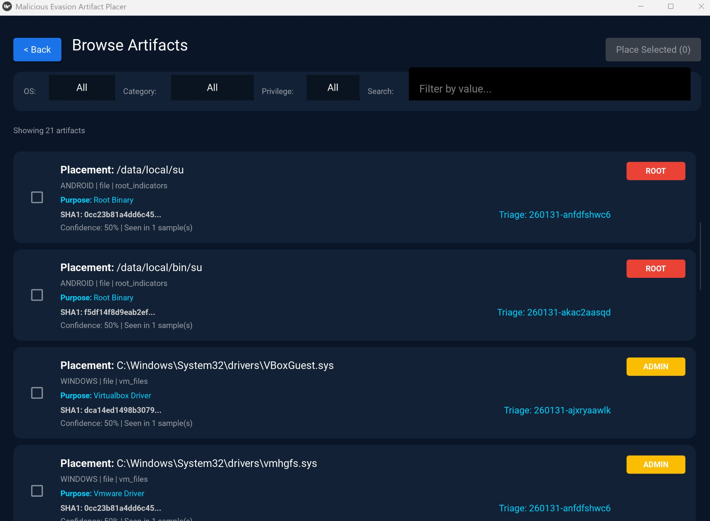
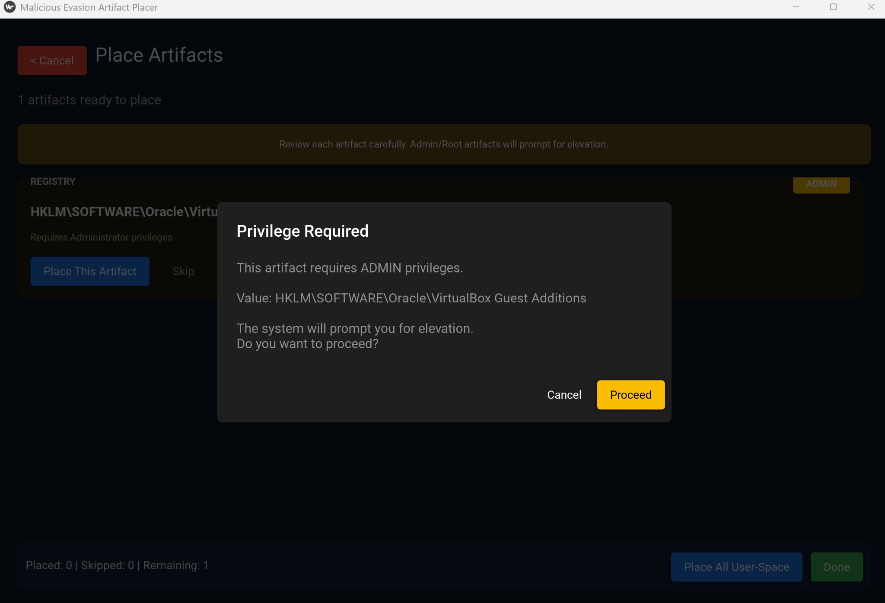
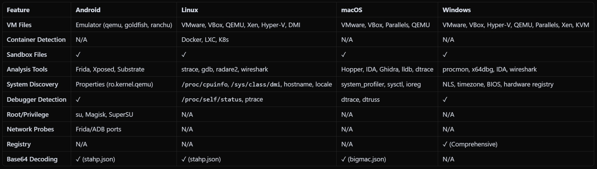

# Malicious Evasion Artifact Placer (MEAP)

A tool for extracting anti-analysis and evasion artifacts from malware behavioral reports and placing them on systems to mimic sandboxes that cause malware to terminate.



## Screenshots

| Browse Artifacts | Place Artifact |
|:---:|:---:|
|  |  |

### Extraction Patterns by OS



## Disclaimer

> **WARNING: USE AT YOUR OWN RISK**
>
> This software is provided "AS IS", without warranty of any kind, express or implied, including but not limited to the warranties of merchantability, fitness for a particular purpose, and noninfringement. In no event shall the authors or copyright holders be liable for any claim, damages, or other liability, whether in an action of contract, tort, or otherwise, arising from, out of, or in connection with the software or the use or other dealings in the software.
>
> **EXERCISE EXTREME CAUTION** before placing any artifact on your machine, phone, or any other device. The artifacts extracted by this tool are derived from real malware samples and may:
> - Trigger security software alerts or quarantine actions
> - Modify system files, registry entries, or configurations
> - Require administrator/root privileges to place or remove
> - Potentially cause system instability if placed incorrectly
>
> **This tool is intended for security research, testing, and educational purposes only.** Users are solely responsible for understanding the implications of placing artifacts on their systems and for any consequences that may result.
>
> Always test in isolated environments (VMs, sandboxes) before deploying on production systems.

## Overview

The Malicious Evasion Artifact Placer extracts evasion techniques from [Hatching Triage](https://tria.ge) malware analysis reports. These artifacts represent indicators that malware uses to detect analysis environments, including:

- **File paths** checked for sandbox/VM presence (e.g., VirtualBox Guest Additions, VMware Tools)
- **Registry keys** queried to detect virtual environments
- **Process names** enumerated to identify security tools
- **WMI queries** used to fingerprint hardware
- **Network indicators** for environment detection

## Features

- **Multi-OS Support**: Extract artifacts for Windows, Android, Linux, and macOS
- **GUI Application**: User-friendly interface for browsing and placing artifacts
- **CLI Tool**: Command-line interface for automation and scripting
- **API Integration**: Connects to Hatching Triage API to fetch latest evasion samples
- **Intelligent OS Detection**: Automatically infers target OS from sample metadata
- **Caching**: Local SQLite cache to minimize API calls
- **Rate Limiting**: Built-in rate limiting to respect API quotas

## Installation

### Requirements

- Python 3.10+
- Hatching Triage API key (obtain from [tria.ge](https://tria.ge))

### Setup

```bash
# Clone the repository
git clone https://github.com/your-username/malicious-evasion.git
cd malicious-evasion

# Create virtual environment
python -m venv .venv

# Activate virtual environment
# On Windows:
.venv\Scripts\activate
# On Linux/macOS:
source .venv/bin/activate

# Install dependencies
pip install -r requirements.txt

# For GUI, also install GUI requirements
pip install -r gui/requirements.txt
```

### Configuration

Set your Triage API key as an environment variable:

```bash
# On Windows (PowerShell):
$env:TRIAGE_API_KEY = "your-api-key-here"

# On Linux/macOS:
export TRIAGE_API_KEY="your-api-key-here"
```

Or configure in the GUI via Settings.

## Usage

### GUI Application

Launch the graphical interface:

```bash
python -m gui.main
```

**Dashboard Features:**
- View total artifacts, placed count, and privilege requirements
- Select OS sources (Windows, Android, Linux, macOS)
- Check for updates from Triage API
- Browse and manage artifacts
- Place/remove artifacts with one click

### CLI Tool

Extract artifacts from local fixtures:

```bash
python -m extractor.cli extract --input tests/fixtures --os windows
```

Extract from Triage API:

```bash
python -m extractor.cli live --os windows --limit 50
```

Test API connectivity:

```bash
python -m extractor.cli test-api
```

### Capture Test Fixtures

Download sample data for offline testing:

```bash
python scripts/capture_fixtures.py --os android --sample-id <sample_id> --out tests/fixtures
```

## Running Tests

```bash
# Run all tests
pytest

# Run with coverage
pytest --cov=extractor

# Run specific test file
pytest tests/unit/test_os_inference.py -v
```

## Project Structure

```
Malicious Evasion/
├── extractor/           # Core extraction library
│   ├── extractors/      # OS-specific extractors
│   ├── models/          # Data models (Artifact, Sample, etc.)
│   ├── triage/          # Triage API client
│   └── pipeline.py      # Main extraction pipeline
├── gui/                 # Kivy/KivyMD GUI application
│   ├── screens/         # UI screens
│   ├── services/        # Background services
│   └── main.py          # Application entry point
├── tests/               # Test suite
│   ├── fixtures/        # Sample JSON fixtures
│   └── unit/            # Unit tests
├── scripts/             # Utility scripts
└── docs/                # Documentation
```

## Security Considerations

This tool is designed for security professionals to test detection capabilities. Before making this project public or using in any environment:

1. **No Hardcoded Secrets**: API keys are loaded from environment variables only
2. **Isolated Testing**: Always test in VMs or sandboxed environments first
3. **Privilege Awareness**: The tool clearly indicates which artifacts require admin privileges
4. **Reversibility**: All placed artifacts can be removed via the GUI or CLI

## License

MIT License - See [LICENSE](LICENSE) for details.

## Contributing

Contributions are welcome! Please read the contributing guidelines and submit pull requests for any enhancements.

## Acknowledgments

- [Hatching Triage](https://tria.ge) for malware analysis API
- [KivyMD](https://kivymd.readthedocs.io/) for Material Design components
